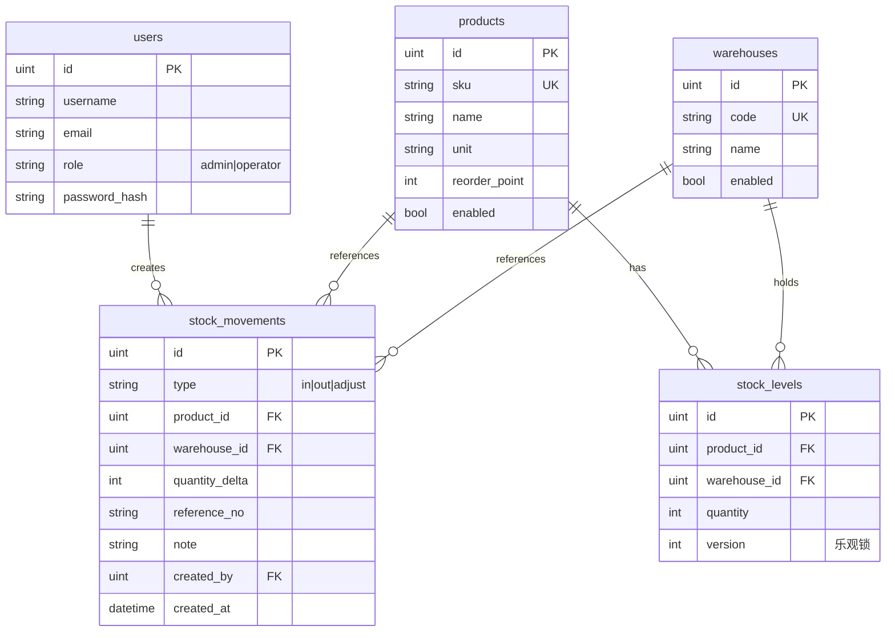

# 库存管理系统（IMS）规格说明

> 状态：**规格 v1.1**（评审结论已写入 §0、§12）  
> 目标：在 k-project 工作区内新增独立前后端应用，前端采用 **最新 React 技术栈**，后端对齐 `apps/user-backend` 的 Gin/GORM/JWT 模式。

---

## 0. 已拍板（评审结论）

| # | 议题 | 结论 |
|---|------|------|
| 1 | v1 嵌入 Host | **是（必须）**。子应用经无界挂载，同源 entry **`/micro/inventory/`**（见 §2.4） |
| 2 | 公开注册 | **关闭**。`ALLOW_REGISTER=false`；仅 **admin** 可创建账号（`POST /api/v1/users`） |
| 3 | 数据库 | 独立库 **`inventory`**（与 `app` 分离） |
| 4 | SKU 编码 | **简单实现**：非空、trim、库内唯一；**不做**正则/校验位 |
| 5 | 负库存 | **v1 允许**。出库不校验 `quantity >= 0`；仪表盘可对 `quantity < 0` 单独标红 |
| 6 | 供应商 / 批次 / 调拨 | v1 **不做**；**v1.1 供应商不与 v1 同发**；分阶段见 **§12** |

---

## 1. 背景与目标

### 1.1 业务目标

提供一套可运行的 **库存管理（Inventory Management System, IMS）** MVP，覆盖：

- 商品（SKU）主数据
- 仓库与库位
- 实时库存数量（按 SKU × 仓库）
- 出入库流水（可审计）
- 基础权限（登录 + 管理员 / 操作员）

### 1.2 非目标（v1 不做）

- 采购订单、销售订单、财务对账
- 供应商主数据、批次/效期、多仓调拨单（见 §12 路线图）
- 条码扫描硬件
- 与 `user-backend` 用户表打通（v1 独立账号体系；v2 可 SSO）
- 复杂审批流、多租户
- 供应商（v1.1，不与 v1 同发）

### 1.3 成功标准（可验证）

| # | 标准 |
|---|------|
| 1 | `inventory-backend` 提供 Swagger、`go test ./...` 通过 |
| 2 | `inventory-front` 可登录，完成 SKU CRUD、入库、出库、库存查询 |
| 3 | 任意出入库后，库存数量与流水一致（事务 + 乐观锁）；允许余额为负 |
| 4 | Docker Compose + `k-project.com` 网关可同源访问（无 CORS） |
| 5 | 端口与 [`WORKSPACE.md`](./WORKSPACE.md) 名单一致 |
| 6 | 从 **Host** 顶栏进入「库存」子应用，无界加载 `entryUrl=/micro/inventory/` 可登录并操作 |

---

## 2. 工作区落位

### 2.1 新目录

| 目录 | 说明 | 独立 Git |
|------|------|----------|
| `apps/inventory-backend` | Go API | 建议 `git init`（与 `user-backend` 一致） |
| `apps/inventory-front` | React SPA | 建议 `git init` |

### 2.2 端口（写入 WORKSPACE.md）

| 服务 | 类型 | 端口 |
|------|------|------|
| `inventory-front` | 前端 | **8103** |
| `inventory-backend` | 后端 | **8501** |

同步位置：`vite.config.*`、`docker/nginx.conf`、`infra/gateway/nginx.conf` upstream、`infra/docker/docker-compose.yml`。

### 2.3 网关路径（单域名）

在现有 `k-project.com` 方案上扩展（与 hello/user 子应用**同一套路**）：

| 浏览器路径 | 转发目标 |
|------------|----------|
| `http://k-project.com/micro/inventory/` | `inventory-front:8103`（rewrite 去 `/micro/inventory/` 前缀） |
| `http://k-project.com/api/inventory/v1/...` | `inventory-backend:8501` 的 `/api/v1/...` |

Nginx 示意：

```nginx
upstream inventory_app {
    server inventory-front:8103;
}
upstream inventory_api {
    server inventory-backend:8501;
}

location /api/inventory/ {
    rewrite ^/api/inventory/(.*)$ /api/$1 break;
    proxy_pass http://inventory_api;
    # ... 标准 proxy_set_header
}

location /micro/inventory/ {
    rewrite ^/micro/inventory/(.*)$ /$1 break;
    proxy_pass http://inventory_app;
    # ...
}
```

子应用构建：`vite.config` 使用 `base: './'`（与 `user-front` 一致）。

前端环境变量：

```env
VITE_API_BASE=/api/inventory
```

请求示例：`GET /api/inventory/v1/products` → 后端 `GET /api/v1/products`。

### 2.4 与微前端 Host 的关系（v1 必须）

| 项 | 约定 |
|----|------|
| 父应用 | `apps/host`（React 17 + wujie-react） |
| 子应用 | `apps/inventory-front`（React 19），由 `WujieReact` iframe 加载 |
| 入口 URL | 同源 **`/micro/inventory/`**；多端口 dev 时为 `http://localhost:8103/` |
| 菜单来源 | `GET /api/v1/navigation`（`user-backend`），**不是** Host 写死 |

**v1 必须改动的关联仓库**（与 IMS 同里程碑交付）：

| 仓库 | 改动 |
|------|------|
| `user-backend` | 导航 seed 增加 `key: inventory` 应用及 routes；`config` 增加 `MICRO_INVENTORY_ENTRY_URL`（默认 `/micro/inventory/`）；`NavigationService` merge entryUrl |
| `infra/gateway` | `upstream` + `location /micro/inventory/` |
| `infra/docker` | `inventory-front` / `inventory-backend` 服务；MySQL init 建库 `inventory` |
| `apps/host` | 多端口 dev 时无需硬编码 inventory（由 API 下发）；若仍用 Mock 联调则同步 Mock（可选） |
| `apps/inventory-front` | `base: './'`；路由 basename 适配 Host Hash（见 `docs/MICROFRONTEND.md`） |

导航 payload 示例（入库部分，无 `entryUrl`）：

```json
{
  "key": "inventory",
  "title": "库存管理",
  "microAppKey": "inventory",
  "subAppBusName": "inventory-front",
  "routes": [
    { "key": "dashboard", "path": "/", "label": "概览" },
    { "key": "products", "path": "/products", "label": "商品" },
    { "key": "warehouses", "path": "/warehouses", "label": "仓库" },
    { "key": "stock", "path": "/stock", "label": "库存" },
    { "key": "movements", "path": "/movements", "label": "流水" },
    { "key": "move-in", "path": "/movements/in", "label": "入库" },
    { "key": "move-out", "path": "/movements/out", "label": "出库" }
  ]
}
```

环境变量（`user-backend`）：

| app `key` | 环境变量 | 默认（网关） |
|-----------|----------|--------------|
| `inventory` | `MICRO_INVENTORY_ENTRY_URL` | `/micro/inventory/` |

**React 版本**：子应用在无界 iframe 内运行，与 Host React 17 **隔离**；P0 验收需在 Host 内实测 React 19 子应用加载与路由同步。若遇兼容问题，备选为 inventory-front 降至 React 18（仍新于 Host 17）。

**不提供** v1 独立书签入口 `/inventory/`（避免双入口）；调试可直接开 `http://localhost:8103/` 或网关 `/micro/inventory/`。

---

## 3. 技术栈

### 3.1 后端（对齐 user-backend）

| 项 | 选型 |
|----|------|
| 语言 | Go **1.22.x** |
| HTTP | [gin-gonic/gin](https://github.com/gin-gonic/gin) v1.10 |
| ORM | [gorm.io/gorm](https://gorm.io) + `gorm.io/driver/mysql` |
| 认证 | [golang-jwt/jwt](https://github.com/golang-jwt/jwt) v5 + bcrypt |
| 配置 | [godotenv](https://github.com/joho/godotenv) + `internal/config` |
| 日志 | [uber-go/zap](https://github.com/uber-go/zap) |
| 文档 | [swaggo/swag](https://github.com/swaggo/swag) + gin-swagger |
| 校验 | gin `binding` + `go-playground/validator`（经 gin 间接依赖） |

**目录结构**（复制 `user-backend` 分层）：

```
apps/inventory-backend/
├── cmd/server/main.go
├── internal/
│   ├── config/
│   ├── db/
│   ├── handler/
│   ├── middleware/    # JWTAuth, RequireRole, RequestLogger
│   ├── model/
│   ├── repository/
│   ├── router/
│   └── service/
├── pkg/logger/
├── docs/              # swag 生成
├── Dockerfile
├── Makefile           # lint, swag, test
├── go.mod
└── .env.example
```

### 3.2 前端（最新 React）

| 项 | 选型 | 说明 |
|----|------|------|
| 运行时 | **React 19.x** + **react-dom 19** | 与 workspace 内 user-front (17) 刻意区分 |
| 构建 | **Vite 8** + `@vitejs/plugin-react` | 对齐 user-front 的 Vite 大版本 |
| 语言 | **TypeScript 6** | strict |
| 路由 | **react-router-dom 7** | 数据路由可选，v1 用经典 `<Routes>` 即可 |
| UI | **Ant Design 5** + `@ant-design/icons` | 表格/表单/Modal 适合后台 |
| HTTP | `fetch` 封装 + Bearer token | 或轻量 `ky`；v1 不强制 axios |
| 类型 | `openapi-typescript` 从 Swagger 生成 | 脚本可参考 `user-front/scripts/generate-api-types.mjs` |

**Node 工具链**：与 `apps/host` 一致 — Node **20.19.x**、**pnpm 10**（`engines` 写入 `package.json`）。

**目录结构**：

```
apps/inventory-front/
├── src/
│   ├── api/           # client + generated types
│   ├── components/    # 通用布局、表格封装
│   ├── pages/         # 按功能分页
│   ├── hooks/         # useAuth 等
│   ├── routes/
│   ├── App.tsx
│   └── main.tsx
├── vite.config.ts     # port 8103, base: './'
├── Dockerfile
└── package.json
```

---

## 4. 领域模型

### 4.1 ER 概览



### 4.2 表说明

#### `users`

与 `user-backend` 同形：`role` 为 `admin` | `operator`（IMS 不用 `user` 泛化角色名亦可，建议 **admin / operator** 语义更清晰）。

- `ADMIN_EMAIL` 环境变量：启动时将对应账号提升为 `admin`。

#### `products`

| 字段 | 类型 | 约束 |
|------|------|------|
| sku | varchar(64) | 唯一，非空 |
| name | varchar(255) | 非空 |
| unit | varchar(16) | 默认 `pcs` |
| reorder_point | int | 默认 0，低库存预警阈值 |
| enabled | bool | 默认 true |

#### `warehouses`

| 字段 | 类型 | 约束 |
|------|------|------|
| code | varchar(32) | 唯一 |
| name | varchar(128) | 非空 |
| enabled | bool | 默认 true |

#### `stock_levels`

- 唯一索引：`(product_id, warehouse_id)`
- `quantity`：**可为负数**（v1 不拦出库；UI/报表对 `< 0` 告警）
- `version`：每次更新库存 +1，更新时 `WHERE version = ?` 防止并发覆盖

#### `stock_movements`（只追加，不修改删除）

| type | quantity_delta | 含义 |
|------|----------------|------|
| `in` | > 0 | 入库 |
| `out` | < 0 | 出库（存负数） |
| `adjust` | 正或负 | 盘点调整 |

---

## 5. API 设计

**Base path（对外）**：`/api/inventory/v1`  
**Base path（服务内注册）**：`/api/v1`

统一错误体：`{ "error": "message" }`（与 user-backend 一致）。

### 5.1 认证与用户

| 方法 | 路径 | 鉴权 | 说明 |
|------|------|------|------|
| POST | `/auth/login` | 否 | 返回 JWT |
| GET | `/me` | Bearer | 当前用户 |
| POST | `/users` | admin | 创建操作员/管理员（`ALLOW_REGISTER=false` 时替代公开注册） |
| GET | `/users` | admin | 用户列表（分页，v1 可选） |

`POST /auth/register`：**v1 不实现**（或实现但 `ALLOW_REGISTER=false` 时固定返回 `403`）。

### 5.2 商品

| 方法 | 路径 | 角色 | 说明 |
|------|------|------|------|
| GET | `/products` | 登录 | 分页 `?page=&page_size=&q=&enabled=` |
| GET | `/products/:id` | 登录 | 详情 |
| POST | `/products` | admin | 创建 |
| PUT | `/products/:id` | admin | 更新 |
| DELETE | `/products/:id` | admin | 软删：`enabled=false` |

### 5.3 仓库

| 方法 | 路径 | 角色 |
|------|------|------|
| GET | `/warehouses` | 登录 |
| POST | `/warehouses` | admin |
| PUT | `/warehouses/:id` | admin |

### 5.4 库存

| 方法 | 路径 | 角色 | 说明 |
|------|------|------|------|
| GET | `/stock-levels` | 登录 | 筛选 `product_id`, `warehouse_id`, `low_stock=1` |
| GET | `/stock-levels/summary` | 登录 | 按 SKU 汇总全仓数量（可选 v1.1） |

### 5.5 出入库

| 方法 | 路径 | 角色 | 说明 |
|------|------|------|------|
| POST | `/stock-movements/in` | operator+ | body: product_id, warehouse_id, quantity, reference_no?, note? |
| POST | `/stock-movements/out` | operator+ | **不**校验库存充足（可扣成负数） |
| POST | `/stock-movements/adjust` | admin | 盘点调整 |
| GET | `/stock-movements` | 登录 | 分页流水查询 |

### 5.6 出入库单（可编辑，AG Grid 页）

面向非标货品（不锈钢板、棒材等）：`goods_detail` 自由文本；`party_name` / `party_contact` 表示交易主体。

| 方法 | 路径 | 角色 | 说明 |
|------|------|------|------|
| GET | `/inventory-transactions` | operator+ | 分页；`type`、`party_name`、`q`、`biz_from`、`biz_to` |
| POST | `/inventory-transactions` | operator+ | 新增；未传 `product_id` 时使用 SKU `MISC` 杂项商品 |
| PUT | `/inventory-transactions/:id` | operator+ | 编辑；冲销原 `movement_id` 再写入新流水 |

前端路由：`/transactions`（`inventory-front` + AG Grid Community）。

### 5.7 销售发货单（还款协议）

面向不锈钢零售开单：按重量计价（`amount = weight_kg × unit_price`），品名规格自由文本；**不联动库存**。

| 方法 | 路径 | 角色 | 说明 |
|------|------|------|------|
| GET | `/sales-deliveries` | operator+ | 分页；`party_b_name`、`q`、`doc_from`、`doc_to` |
| GET | `/sales-deliveries/:id` | operator+ | 详情（含 `items` 明细行） |
| POST | `/sales-deliveries` | operator+ | 新建；`doc_no` 自动生成（`SD` + 日期 + 序号） |
| PUT | `/sales-deliveries/:id` | operator+ | 编辑；明细行全量替换 |

**主表字段**：`doc_no`、`doc_date`、`party_a_name`（甲方）、`party_b_name`（乙方）、`warehouse_name`、`phone`、`total_amount`、`paid_amount`、`balance_due`。

**明细行**：`product_spec`、`quantity`（件数）、`weight_kg`、`unit_price`、`amount`、`note`。

前端路由：`/sales-deliveries`（列表）、`/sales-deliveries/new`（新建）、`/sales-deliveries/:id`（详情）、`/sales-deliveries/:id/edit`（编辑）。

**事务规则**（`internal/service/stock_service.go`）：

1. 开启 DB 事务
2. 锁定/读取 `stock_levels` 行（`SELECT ... FOR UPDATE` 或 version 更新）
3. ~~校验出库后 `quantity >= 0`~~（v1 跳过，允许负库存）
4. 插入 `stock_movements`
5. 更新 `stock_levels.quantity` 与 `version`
6. 提交；冲突返回 `409` + `stock conflict, retry`

### 5.6 健康与文档

| 路径 | 说明 |
|------|------|
| GET `/healthz` | 无鉴权 |
| GET `/swagger/*` | 开发环境可开 |

---

## 6. 前端页面（v1）

| 路由 | 页面 | 功能 |
|------|------|------|
| `/login` | 登录 | JWT 存 `localStorage`（key: `ims_token`） |
| `/` | 仪表盘 | 低库存 SKU 数、今日出入库笔数 |
| `/products` | 商品列表 | 搜索、分页、新建/编辑（admin） |
| `/warehouses` | 仓库 | 列表与维护 |
| `/stock` | 库存查询 | 按仓/SKU 筛选 |
| `/movements` | 流水 | 时间范围筛选 |
| `/movements/in` | 入库 | 表单 |
| `/movements/out` | 出库 | 表单 + 可用库存展示 |
| `/sales-deliveries` | 销售发货单 | 列表、筛选、新建/查看/编辑 |

**布局**：左侧菜单 + 顶栏用户；未登录跳转 `/login`。

**权限**：前端按 `me.role` 隐藏 admin 菜单；真正的权限以后端为准。

---

## 7. 配置与环境变量

### 7.1 inventory-backend `.env.example`

```env
HTTP_ADDR=:8501
GIN_MODE=debug

DB_HOST=127.0.0.1
DB_PORT=3306
DB_USER=root
DB_PASSWORD=
DB_NAME=inventory

JWT_SECRET=change-me
JWT_EXPIRE_HOURS=24
ADMIN_EMAIL=admin@example.com

# 公开注册（v1 固定 false；保留变量便于以后打开）
ALLOW_REGISTER=false
```

### 7.2 Docker Compose 增量

- 新增服务 `inventory-backend`、`inventory-front`
- MySQL：增加库 `inventory`（`MYSQL_DATABASE` 仅支持单库时，用 init SQL 脚本创建第二库）
- `gateway` 依赖新服务

### 7.3 本地开发（多端口模式）

```bash
# 终端 1
cd apps/inventory-backend && cp .env.example .env && go run ./cmd/server

# 终端 2
cd apps/inventory-front && pnpm dev
# Vite proxy（仅 dev）：/api/inventory -> http://127.0.0.1:8501/api
```

---

## 8. 实现阶段建议

| 阶段 | 内容 | 预估 |
|------|------|------|
| **P0 脚手架** | 双应用 init、登录、端口/网关、`/micro/inventory/`、**user-backend 导航 seed + entryUrl**、Host 内可打开子应用 | 1–1.5d |
| **P1 主数据** | products / warehouses CRUD + 前端列表 | 1d |
| **P2 库存核心** | stock_levels + movements 事务 + 出入库页 | 1–2d |
| **P3 打磨** | 负库存展示、Swagger、Docker、README | 0.5–1d |
| **P4（v1.1）** | 供应商主数据 + 入库关联供应商（§12.1）；**不与 v1 同发** | 0.5–1d |
| **P5** | 多仓调拨单（§12.3） | 1d |
| **P6** | 批次/效期（§12.2，模型变更大） | 2–3d |
| **后续** | 与 user-backend SSO（统一账号） | v2 |

---

## 9. 质量与安全

- 密码仅存 bcrypt hash；JWT secret 不得入库
- 所有写接口 CSRF：同源 SPA + Bearer，无 cookie session
- `go test`：至少覆盖 `stock_service` 的入库、出库至负数、并发 version
- `pnpm run typecheck` + eslint
- 不提交 `.env`；Compose 内 JWT 仅开发用

---

## 10. ~~待确认项~~ → 见 §0

---

## 11. 参考文件

- 后端模式：`apps/user-backend/`、`apps/user-backend/.cursor/skills/go-gin-gorm-service/SKILL.md`
- 前端模式：`apps/user-front/`（API 类型生成、Vite base）
- 端口与网关：`docs/WORKSPACE.md`、`docs/SINGLE_DOMAIN.md`、`infra/gateway/nginx.conf`

---

## 12. 扩展能力：供应商、批次、多仓调拨

> v1 只做 §4 的无批次、单维库存（SKU × 仓）。以下按**推荐落地顺序**设计，避免 v1 表结构推倒重来。

### 12.0 阶段总览


| 阶段 | 能力 | 改动量 | 依赖 |
|------|------|--------|------|
| **v1** | 入/出/调整、负库存允许 | — | — |
| **v1.1 供应商** | 供应商档案；入库可选填供应商 | 小 | v1 |
| **v1.2 调拨** | 仓间调拨单，一次事务双边记账 | 中 | v1 |
| **v2 批次** | 批次号、效期、按批次余额与出库 | **大** | 建议 v1.2 后再做 |

---

### 12.1 供应商（v1.1，**不与 v1 同发**）

**要解决什么**：知道「货从哪来」，还不做到完整采购（PO、付款、到货预约）。

**数据模型**

```
suppliers
  id, code (UK), name, contact_name, phone, enabled, created_at

stock_movements  -- 在 v1 表上增加可空字段
  supplier_id NULL   -- 仅 type=in 时建议填写
```

**行为**

- Admin 维护供应商 CRUD。
- 入库接口增加可选 `supplier_id`；列表/流水可按供应商筛选。
- **不做**：采购订单、价格、税率、对账。

**API 增量**

- `GET/POST/PUT /suppliers`
- `POST /stock-movements/in` body 增加 `supplier_id?`

**前端**：供应商管理页；入库表单下拉选供应商。

---

### 12.2 批次与效期（建议 v2）

**要解决什么**：同一 SKU 多批号并存、出库按效期优先（FEFO）、召回某批次。

**为何放 v2**：v1 的 `stock_levels(product_id, warehouse_id)` **无法**表达「同仓同 SKU 两批各 100」。上批次等于改库存维度，并牵动所有出入库 UI。

**推荐模型（上线批次时一次性迁移）**

```
products
  track_batch bool default false   -- 是否按批次管理

batch_lots
  id, product_id, batch_no, mfg_date NULL, expiry_date NULL
  UNIQUE(product_id, batch_no)

stock_levels   -- 维度升级
  UNIQUE(product_id, warehouse_id, batch_lot_id)
  batch_lot_id NULL  -- 非批次商品用 NULL 表示「默认批次」

stock_movements
  batch_lot_id NULL
```

**出库策略（可配置，默认 FEFO）**

- `track_batch=false`：与 v1 相同，只扣 `(product, warehouse)` 上 `batch_lot_id IS NULL` 的行。
- `track_batch=true`：出库必须指定 `batch_lot_id`，或传 `strategy=fefo` 由服务按 `expiry_date ASC` 自动拆扣（多行 movement）。

**迁移策略**

1. 为现有 `stock_levels` 插入虚拟批次 `DEFAULT`（`batch_lot_id` 指向该记录）或保持 `NULL` 单轨。
2. 新商品在创建时勾选「启用批次」。

**v1 预留（零成本）**

- `products` 表可加 `track_batch bool default false`（v1 不用）；或 v2 再加列。

---

### 12.3 多仓调拨（建议 v1.2）

**要解决什么**：从 A 仓调到 B 仓，**一条业务单**对应**两条库存变动**，避免手工先出再入对不上。

**数据模型**

```
stock_transfers
  id, transfer_no (UK), from_warehouse_id, to_warehouse_id
  status: draft | completed | cancelled
  note, created_by, created_at, completed_at NULL

stock_transfer_lines
  id, transfer_id, product_id, quantity (>0)
```

**状态机**

| 状态 | 说明 |
|------|------|
| `draft` | 仅保存意向，**不动库存** |
| `completed` | 事务内：对每个 line，`out(from)` + `in(to)`，quantity 相同 |
| `cancelled` | 仅 draft 可取消 |

**与流水的关系**

- `completed` 时生成 2×N 条 `stock_movements`（或 1 条 type=`transfer_out` + 1 条 `transfer_in`，推荐后者便于报表）：
  - `type=transfer_out`，`warehouse_id=from`，`quantity_delta=-q`，`transfer_id`
  - `type=transfer_in`，`warehouse_id=to`，`quantity_delta=+q`，`transfer_id`
- 调出仓允许负库存（与你 v1 策略一致）；若以后要拦，只在 `transfer_out` 加可选开关。

**API**

- `POST /stock-transfers` 创建 draft
- `PUT /stock-transfers/:id/lines` 维护明细
- `POST /stock-transfers/:id/complete`
- `POST /stock-transfers/:id/cancel`
- `GET /stock-transfers` 列表

**前端**：调拨单列表 + 编辑页（选源仓/目标仓、行项目）；完成前展示两侧当前库存参考。

**与供应商/批次**

- v1.2 调拨**不**带供应商。
- 若 v2 已上批次：调拨行需带 `batch_lot_id`，两边扣增同一批次。

---

### 12.4 三者组合时的业务场景

| 场景 | 涉及能力 |
|------|----------|
| 向供应商采购入库 | v1.1 供应商 + v1 入库 |
| 门店要货（仓 A → 仓 B） | v1.2 调拨单 |
| 进口奶粉按效期出库 | v2 批次 + FEFO |
| 供应商退货出库 | v1.1 供应商 + v1 出库（`reference_no` 记退货单号） |
| 调拨在途 | v2+ 可增加 `status=in_transit` 与发出/接收两步（v1.2 不做） |

---

### 12.5 若你希望提前「少改表」

在 v1 的 `stock_movements` 上**现在**就加可空列（不用可先不填）：

| 列 | 用途 |
|----|------|
| `supplier_id` | v1.1 |
| `transfer_id` | v1.2 |
| `batch_lot_id` | v2 |

`stock_levels` **不要**在 v1 加 `batch_lot_id`（会破坏唯一索引语义）；批次上线时再改表 + 迁移。
