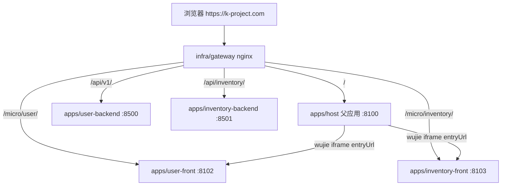

# 微前端快速搭建方案

> 在 k-project 工作区中，如何快速新增子应用（及可选后端），并接入父应用 Host、网关与导航 API。  
> 关联文档：[MICROFRONTEND.md](./MICROFRONTEND.md)、[WORKSPACE.md](./WORKSPACE.md)、[SINGLE_DOMAIN.md](./SINGLE_DOMAIN.md)、[NAVIGATION_CONFIG.md](./NAVIGATION_CONFIG.md)。

## 核心结论

**父应用 `apps/host` 通常只建一次。** 日常「搭新工程」= 在现有 Host 下**新增子应用**（+ 可选独立后端）。

- **推荐复制范本**：`apps/inventory-front`（React 19、antd 5、`config/routes`、完整 wujie 适配）
- **结构范本**：`apps/user-front`（React 17、antd 4，与用户中心/登录深度集成时用）
- **最小 demo**：`apps/hello-front`（能挂进 Host，无完整侧栏路由同步）

---

## 1. 架构一览



| 角色 | 目录 | 技术栈 | 职责 |
|------|------|--------|------|
| 父应用 | `apps/host` | React 17 + antd 4 + wujie-react | 壳层、顶栏/侧栏、多页签、挂载子应用 |
| 子应用（范本 A） | `apps/user-front` | React 17 + TS + antd 4 | 用户中心，**目录结构范本** |
| 子应用（范本 B） | `apps/inventory-front` | React 19 + TS + antd 5 | **最新脚手架范本**，推荐复制 |
| 试验子应用 | `apps/hello-front` | React 17 + JSX | 最小示例 |
| 导航 API | `apps/user-backend` | Go/Gin | `GET /api/v1/navigation` 下发菜单并 merge `entryUrl` |

---

## 2. 两种场景

### 场景 A：在现有 k-project 里加一个新子应用（最常见）

例如新增 `order-front`（订单域）。**不需要新建父应用**，按本文第 4～6 节清单接入即可。

### 场景 B：从零搭一套「父 + 子」

1. 复制 `apps/host` → 新父应用仓库
2. 复制 `apps/inventory-front`（或 `user-front`）→ 第一个子应用
3. 复制 `infra/gateway`、`infra/docker` 相关片段
4. 可选：复制 `apps/user-backend` 做导航/用户中心

k-project 已具备完整链路，**优先走场景 A**。

---

## 3. 命名与端口规划

**先改 [`WORKSPACE.md`](./WORKSPACE.md) 端口表，再写代码。** 改端口须同步 6 处：端口表 → 子应用 Vite → 子应用 docker/nginx → gateway upstream → compose → host `.env`。

以新增 `order` 域为例：

| 项 | 约定 | 示例 `order` |
|----|------|--------------|
| 应用 key | Hash 第一段、导航唯一 | `order` |
| 目录名 | `apps/<name>-front` | `apps/order-front` |
| 前端 dev 端口 | 8100 起递增 | **8104**（当前 8103 为 inventory） |
| 网关子应用路径 | `/micro/<key>/` | `/micro/order/` |
| `subAppBusName` | 与子应用 `SUB_APP_NAME` 一致 | `order-front` |
| 父→子 bus 事件 | `{subAppBusName}-route` | `order-front-route` |
| 子→父 bus 事件 | 固定共用 | `sub-route-change` |
| 后端（若有） | 8500 起递增 | `8502`，网关 `/api/order/` |

---

## 4. 子应用脚手架

### 4.1 复制范本

```bash
cd apps
cp -R inventory-front order-front   # 推荐：结构最全
cd order-front
# 全局替换：inventory → order、8103 → 8104、inventory-front → order-front
```

### 4.2 必选改动文件

| 文件 | 改什么 |
|------|--------|
| `package.json` | `name`、dev 端口 |
| `vite.config.ts` | `server.port`、`base: './'`（必须）、proxy |
| `src/utils/wujie.ts` | `SUB_APP_NAME`、`ORDER_ROUTE_EVENT` |
| `src/components/WujieRouteBridge/` | 订阅 `{app}-route` 事件名 |
| `src/main.tsx` | wujie 生命周期（`__WUJIE_MOUNT` / `__WUJIE_UNMOUNT`） |
| `config/routes.ts` | 业务路由 |
| `docker/nginx.conf` | `listen` 端口 |
| `Dockerfile` | `EXPOSE`、构建参数 |

### 4.3 标准目录（以 `user-front` / `inventory-front` 为准）

```
apps/<subapp>/
├── config/routes.ts              # 路由唯一真源
├── src/
│   ├── App.tsx                   # BrowserRouter + WujieRouteBridge + Routes
│   ├── main.tsx                  # 区分 wujie 与独立运行
│   ├── api/                      # client.ts + 按域拆分
│   ├── components/WujieRouteBridge/
│   ├── layouts/
│   ├── pages/
│   ├── styles/
│   └── utils/                    # router.tsx、wujie.ts
├── vite.config.ts                # base: './'
└── package.json
```

路由用 `config/routes.ts` + `src/utils/router.tsx`（`import.meta.glob`），**不要**在 `App.tsx` 手写 `<Route />`。

### 4.4 无界必做约定

```ts
// vite.config.ts — 子应用静态资源必须相对路径
export default defineConfig({
  base: './',
  // ...
});
```

```ts
// main.tsx — 被 wujie 加载时只注册钩子
if (IS_WUJIE) {
  window.__WUJIE_MOUNT = renderApp;
  window.__WUJIE_UNMOUNT = unmountApp;
} else {
  renderApp();
}
```

`WujieRouteBridge` 职责：

1. 读 `$wujie.props.initialPath`，启动时 `navigate` 一次（含 0/50/200ms 重试）
2. `bus.$on(<APP>-route, …)` 被动跳转
3. 子路由变化时 `bus.$emit('sub-route-change', SUB_APP_NAME, { path, instanceId })`

### 4.5 鉴权与 API

| 模式 | `VITE_API_BASE` | 说明 |
|------|-----------------|------|
| 共用 user 登录 | 空 | token 键 `user-front:access-token`（与 Host 顶栏一致） |
| 独立后端域 | `/api/order` | 参考 inventory；`vite proxy` rewrite 到 `:8502` |

### 4.6 工具链

```bash
nvm use          # 根目录 .nvmrc → Node 20.19.x
corepack enable && corepack prepare pnpm@10.28.2 --activate
cd apps/order-front && pnpm install && pnpm dev
```

---

## 5. 平台接入清单

新增子应用要在 **6 层** 注册，漏一处会出现「菜单有、iframe 白屏」或 dev 套娃。

### 5.1 文档

- [ ] [`docs/WORKSPACE.md`](./WORKSPACE.md) 增加端口行
- [ ] [`docs/SINGLE_DOMAIN.md`](./SINGLE_DOMAIN.md) 增加 `/micro/order/` 路径说明

### 5.2 网关 `infra/gateway/`

在 `nginx.host.conf` 与 `nginx.docker.conf` 各增加：

```nginx
location /micro/order/ {
    set $order_app_upstream host.docker.internal:8104;  # docker 模式用 order-front:8104
    rewrite ^/micro/order/(.*)$ /$1 break;
    proxy_pass http://$order_app_upstream;
}
```

若有独立 API：

```nginx
location /api/order/ {
    set $order_api_upstream host.docker.internal:8502;
    rewrite ^/api/order/(.*)$ /api/$1 break;
    proxy_pass http://$order_api_upstream;
}
```

### 5.3 Docker Compose `infra/docker/docker-compose.yml`

- [ ] 新增 `order-front` service（build context、`VITE_API_BASE`）
- [ ] 可选 `order-backend` service
- [ ] `user-backend` env 增加 `MICRO_ORDER_ENTRY_URL: /micro/order/`
- [ ] `host` build args 增加 `VITE_ORDER_FRONT_URL: /micro/order/`

### 5.4 父应用 `apps/host`

| 文件 | 改动 |
|------|------|
| `vite.config.js` | `'/micro/order': microProxy('/micro/order', 8104)` |
| `src/api/navigationNormalize.js` | `ENTRY_BY_APP_KEY` 增加 `order: import.meta.env.VITE_ORDER_FRONT_URL` |
| `.env.development` | `VITE_ORDER_FRONT_URL=http://localhost:8104/` |
| `.env.k-project.com` | `VITE_ORDER_FRONT_URL=/micro/order/` |

父应用**不写死**子应用列表；菜单来自导航 API。Host 只负责 entry URL 的 dev 覆盖与 proxy。

### 5.5 导航 `apps/user-backend`

| 文件 | 改动 |
|------|------|
| `internal/config/config.go` | `microEntryURLsFromEnv()` 增加 `"order": getenv("MICRO_ORDER_ENTRY_URL", "/micro/order/")` |
| `internal/service/navigation_service.go` | `DefaultSeedPayload()` 增加 order app（含 `subAppBusName`、`routes`） |
| `.env.example` | `MICRO_ORDER_ENTRY_URL=/micro/order/` |

导航 payload 可编辑部分（`entryUrl` **不入库**）：

```json
{
  "key": "order",
  "title": "订单中心",
  "microAppKey": "order",
  "subAppBusName": "order-front",
  "routes": [
    { "key": "list", "path": "/orders", "label": "订单列表" }
  ]
}
```

`GET /api/v1/navigation` 时由 `MICRO_ORDER_ENTRY_URL` merge `entryUrl`。详见 [NAVIGATION_CONFIG.md](./NAVIGATION_CONFIG.md)。

### 5.6 平台待修项（加第三个以上「带路由同步」子应用前建议先修）

当前 `SubAppView.jsx` 向子应用下发路由时**写死**了 `user-front-route`（见 `apps/host/src/config/wujie.js`）。  
应按 `subAppBusName` 动态发 **`{subAppBusName}-route`**（如 `inventory-front-route`）。建议抽 `subAppRouteEventName(subAppBusName)` 并在 `SubAppView` 使用——一次修好，后续子应用即插即用。

---

## 6. 可选：独立后端（Go）

若子应用需要自己的 API，复制 `apps/inventory-backend` 模式：

```
apps/order-backend/
├── cmd/server/main.go
├── internal/{handler,service,repository,model,router,middleware}
├── go.mod
├── Dockerfile
└── .env.example   # HTTP_ADDR=:8502, DB_NAME=order
```

网关路径前缀 `/api/order/` → 容器内 `/api/...`，与 inventory 一致。

---

## 7. 启动与验收

### 7.1 分层验证

| 步骤 | 命令/操作 | 通过标准 |
|------|-----------|----------|
| 1 子应用独立 | `cd apps/order-front && pnpm dev` | `http://localhost:8104` 可打开 |
| 2 导航 API | `curl https://k-project.com/api/v1/navigation` | 返回 apps 含 order 且带 `entryUrl` |
| 3 Host 挂载 | `cd apps/host && pnpm dev` | 顶栏出现「订单中心」，iframe 加载 |
| 4 路由同步 | 点侧栏 `/orders` | URL Hash 与子应用内路由一致 |
| 5 同源 Docker | `docker compose -f infra/docker/docker-compose.yml up --build` | `https://k-project.com` 全链路 |

### 7.2 常见故障

| 现象 | 原因 | 处理 |
|------|------|------|
| iframe 显示 Host 自己（套娃） | dev 下 `/micro/*` 未 proxy 到子应用端口 | 检查 host `vite.config.js` proxy + `.env.development` 绝对 URL |
| 菜单有、iframe 404 | `entryUrl` 空或网关未配 | 查 `MICRO_*_ENTRY_URL`、nginx location |
| 侧栏点了子应用不跳转 | bus 事件名不一致 | 对齐 `subAppBusName`、子应用 `WujieRouteBridge`、Host `SubAppView` |
| 静态资源 404 | `base` 不是 `'./'` | 改 `vite.config.ts` |

---

## 8. 推荐工作流（最快路径）

```text
1. 定名 + 占端口（WORKSPACE.md）
2. cp inventory-front → 新目录，批量替换标识符
3. 改 wujie.ts + WujieRouteBridge + routes + 首页
4. 接 gateway / compose / host env+proxy
5. user-backend seed 导航 + MICRO_*_ENTRY_URL
6. （建议）修 Host SubAppView 动态 bus 事件
7. pnpm dev 分层验收 → docker 全链路验收
```

**时间预估**：纯前端子应用（无新后端）约 **2～3 小时**；含 Go 后端 + Docker 约 **1 天**（可参考 `openspec/changes/inventory-system-v1/`）。

---

## 9. 范本选择

| 复制谁 | 何时用 |
|--------|--------|
| `inventory-front` | 新业务子应用（React 19、antd 5、config/routes、完整 wujie） |
| `user-front` | 与现有用户中心/登录体系深度集成（antd 4） |
| `hello-front` | 只要「能挂进 Host」的最小 demo，不关心侧栏路由同步 |

---

## 10. 后续可自动化（可选）

当前无 `create-subapp` 脚本，可基于上文清单实现：

```bash
# 设想：scripts/scaffold-subapp.sh order 8104 8502
# 自动：cp 范本、替换字符串、改 WORKSPACE/gateway/compose/host/user-backend 片段
```

---

## 相关文档与 Skill

| 资源 | 说明 |
|------|------|
| [MICROFRONTEND.md](./MICROFRONTEND.md) | wujie 拼法、dev 与同源模式 |
| [WORKSPACE.md](./WORKSPACE.md) | 端口唯一信息源 |
| [SINGLE_DOMAIN.md](./SINGLE_DOMAIN.md) | `k-project.com` 网关与构建 env |
| [NAVIGATION_CONFIG.md](./NAVIGATION_CONFIG.md) | 导航 API 契约与权限 |
| `.cursor/skills/k-project-subapp-front/SKILL.md` | 子应用目录与 wujie 约定（给 AI 用） |
| `AGENTS.md` | 工作区各 `apps/*` 职责 |
