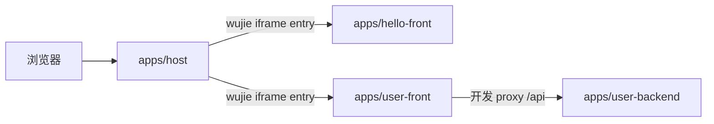

# 工作区说明（k-project）

## 物理布局

```
k-project/
├── apps/
│   ├── host/              # 微前端父应用（原 main-project-front）
│   ├── user-front/
│   ├── hello-front/
│   ├── inventory-front/
│   ├── inventory-backend/
│   └── user-backend/
├── vendor/
│   └── wujie/             # 无界上游源码（参考）
├── docs/                  # 工作区级文档（本文件等）
├── infra/docker/          # Compose 与编排说明
├── AGENTS.md
└── README.md
```

## 仓库与 Git

| 子目录 | 独立 `.git` | 说明 |
|--------|-------------|------|
| `apps/host` | 是 | 父应用，可单独 push |
| `apps/user-front` | 是 | 主业务子应用 |
| `apps/user-backend` | 是 | Go API |
| `vendor/wujie` | 是 | 上游无界仓库，拉取更新时注意与本地魔改冲突 |
| `apps/hello-front` | **否** | 若需版本管理，可在该目录 `git init` 或迁入 monorepo |

根目录 `k-project` 当前无 `.git`；若希望「文档 + compose」也纳入版本控制，可在根目录 `git init`，并用 `.gitignore` 忽略各子目录内已有仓库或改用 submodule。

**说明**：将目录移入 `apps/` / `vendor/` **不会改变**各子仓库的 `origin` 与提交历史；仅本地路径变化。详见 [REPO_LAYOUT.md](./REPO_LAYOUT.md)。

## 端口名单（唯一信息源）

约束：**前端从 8100 起，后端从 8500 起**。每个服务的容器 nginx `listen`、网关 upstream、Vite dev `server.port` 都必须与下表一致；改这张表 = 改全工作区。

| 服务 | 类型 | 端口 | 必须一致的位置 |
|------|------|------|----------------|
| `apps/host` | 前端（父） | **8100** | `vite.config.js` · `docker/nginx.conf` · `infra/gateway/nginx.conf` upstream · compose |
| `apps/hello-front` | 前端（子） | **8101** | `vite.config.js` · `docker/nginx.conf` · `infra/gateway/nginx.conf` upstream · compose |
| `apps/user-front` | 前端（子） | **8102** | `vite.config.ts` · `docker/nginx.conf` · `infra/gateway/nginx.conf` upstream · compose |
| `apps/inventory-front` | 前端（子） | **8103** | `vite.config.ts` · `docker/nginx.conf` · `infra/gateway/nginx.conf` upstream · compose |
| `apps/user-backend` | 后端（Go） | **8500** | `.env` `HTTP_ADDR` · `infra/gateway/nginx.conf` upstream · compose |
| `apps/inventory-backend` | 后端（Go） | **8501** | `.env` `HTTP_ADDR` · `infra/gateway/nginx.conf` upstream · compose |
| `mysql` | 基础设施 | 3306（容器内） / 3307→3306（宿主映射） | `infra/docker/docker-compose.yml`，仅为本机直连库方便保留宿主映射 |
| `gateway` | 入口（nginx） | **80**（唯一对外端口） | `infra/gateway/nginx.conf` · `infra/docker/docker-compose.yml` |

所有内部服务**不再单独暴露宿主端口**：浏览器只通过 `http://k-project.com/` 访问网关，由网关按路径分流，**同源、零 CORS、无反向代理配置**。详见 [SINGLE_DOMAIN.md](./SINGLE_DOMAIN.md)。

## 依赖关系（简图）



## 各子项目文档入口

- 父应用：`apps/host/README.md`、`.cursor/skills/`（若有）
- 子应用 user：`apps/user-front/README.md`
- 试验子应用：`apps/hello-front/README.md`
- 后端：`apps/user-backend/README.md`、`.cursor/rules/`（若有）
- 无界上游：`docs/reference-wujie-upstream.md`
