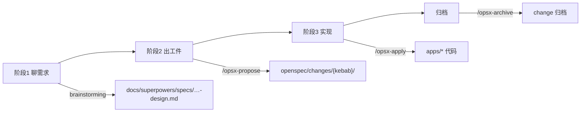

# OpenSpec 工作流（k-project）

适用：**个人 / 小团队**，在 k-project 根目录用 Cursor + OpenSpec 做需求。技术入口见 [tech-rules.md](./tech-rules.md)。

**推荐总流程**：Superpowers 聊需求定方案 → OpenSpec 出工件与清单 → `/opsx-apply` 落地（见下节）。

---

## 标准流程：Superpowers 聊需求 → OpenSpec 执行

三阶段分工明确：**Superpowers 负责想清楚**，**OpenSpec 负责可追踪工件与实现**，不在中间再跑 Superpowers `writing-plans`（OpenSpec 的 `tasks.md` 取代它）。



### 阶段 1：聊需求（Superpowers brainstorming）

**你怎么开**：直接说想做什么，例如「我想给库存加出入库单导出」。

**Agent 怎么做**（`superpowers:brainstorming`）：

- 一次只问一个澄清问题，必要时给 2～3 种方案与取舍
- 分段呈现设计，**你点头后再往下**
- **不写代码、不建 change、不跑 `/opsx-propose`**
- 定稿后写入：`docs/superpowers/specs/YYYY-MM-DD-<topic>-design.md`
- 在 change README 或对话里记下：**涉及哪些 `apps/*` / `infra/*`**

**阶段 1 结束标志**：你说「方案 OK」「可以进 OpenSpec」之类。

### 阶段 2：出方案与清单（OpenSpec propose）

**你怎么开**：

```
/opsx-propose <kebab-case-en>
```

或：「按刚才的方案生成 OpenSpec」。

**Agent 怎么做**（`openspec-propose`）：

- 读取阶段 1 的设计稿 + 已确认的 apps 范围
- `openspec new change` → 依次生成 `proposal.md` → `specs/**` → `design.md` → `tasks.md`
- `tasks.md` 即**可勾选实现清单**（按 app / infra 分组）

**与 Superpowers 的边界**：

| 产出 | 路径 | 谁写 |
|------|------|------|
| 需求讨论稿（人读） | `docs/superpowers/specs/` | brainstorming |
| 正式工件 + 任务清单 | `openspec/changes/{kebab}/` | `/opsx-propose` |
| ~~实施计划~~ | ~~`docs/superpowers/plans/`~~ | **不用**；由 `tasks.md` 替代 |

**阶段 2 结束标志**：`openspec status` 显示 apply 所需工件齐全；Agent 提示「可 `/opsx-apply`」。

### 阶段 3：实现（OpenSpec apply）

**你怎么开**：

```
/opsx-apply
```

或 `/opsx-apply <change-name>`。

**Agent 怎么做**（`openspec-apply-change`）：

- 读 change 下全部上下文，按 `tasks.md` 逐项实现
- 每完成一项：`- [ ]` → `- [x]`
- 业务代码在对应 `apps/*` 仓库 commit；OpenSpec 更新在根仓库 commit

**阶段 3 结束**：`/opsx-archive` 归档。

### 一句话口令（复制即用）

| 意图 | 你说 |
|------|------|
| 新开需求 | 「我想做 …」（走 brainstorming） |
| 方案定了 | 「方案 OK，生成 OpenSpec」或 `/opsx-propose …` |
| 开始写代码 | `/opsx-apply` |
| 做完了 | `/opsx-archive` |
| 已有 tasks，跳过聊需求 | `/opsx-apply`（见下节「直接 apply」） |

### 何时不用阶段 1

- 小改、路径明确、无方案分歧：可直接 `/opsx-propose` 或甚至 `/opsx-apply`（已有 tasks）
- 纯探索、不写工件：用 `/opsx-explore`

---

## 0. 快速回答模式

- **「全部按你的建议」** — 从门禁到生成 proposal/specs/design/tasks 一路走完
- **「只建 change 目录」** — 只跑 `openspec new change`，先不写工件
- **「直接 apply」** — 已有 tasks.md，跳过 propose，跑 `/opsx-apply`

---

## 1. 前置门禁（二缺一不开工）

| 必备项 | 说明 | 缺失处理 |
|--------|------|----------|
| 变更描述 | 一句话说清要做什么 | **停**，向用户确认 |
| 涉及 apps | 列出会改的 `apps/*` 或 `infra/*` | **停**，避免改错仓库 |

可选但推荐：

| 推荐项 | 说明 |
|--------|------|
| Issue / 编号 | GitHub Issue、自编号或 kebab 名前缀，写进 change README |
| 分支 | 各 app 独立 git：在**对应 app 目录**切 feature 分支 |

---

## 2. Change 目录命名

```
openspec/changes/{kebab-case-en}/
├── README.md          # 描述、涉及 apps、Issue、状态、日期
├── .openspec.yaml     # openspec new change 自动生成
├── proposal.md
├── specs/
│   └── **/*.md
├── design.md
└── tasks.md
```

**目录名规则**（OpenSpec CLI 硬要求）：

- 全小写 kebab-case：`^[a-z][a-z0-9]*(-[a-z0-9]+)*$`
- **英文**，不用中文（例：`inventory-transaction-ag-grid`）
- 可与各 app 的 git 分支名不一致

创建命令：

```bash
cd k-project
openspec new change "my-feature-name"
```

Cursor 快捷：`/opsx-propose my-feature-name` 或描述需求让 Agent 推导 kebab 名。

---

## 3. 工件顺序（schema: spec-driven）

```
proposal → specs → design → tasks → 实现 → 归档
```

| 工件 | 谁写 | 内容 |
|------|------|------|
| proposal.md | 需求方 / Agent | Why / What / Capabilities / Impact |
| specs/**/*.md | 同上 | GIVEN/WHEN/THEN 可测场景 |
| design.md | 实现方 / Agent | 改哪些 app、API、网关、数据、验证命令 |
| tasks.md | 同上 | 可勾选任务列表，按 app 分组 |

**Cursor 命令**：

| 命令 | 作用 |
|------|------|
| `/opsx-propose` | 创建 change 并生成 proposal → specs → design → tasks |
| `/opsx-explore` | 探索想法，不写代码 |
| `/opsx-apply` | 按 tasks.md 逐步实现 |
| `/opsx-archive` | 完成后归档 change |

---

## 4. Git 与多仓库

k-project 根目录有 `.git`（文档 + openspec + infra）；各 `apps/*` 多为**独立仓库**。

1. **OpenSpec 工件**：在根仓库 commit（`openspec/`、`workspace-spec/`、`docs/`）
2. **业务代码**：进入对应 `apps/host`、`apps/inventory-front` 等各自 commit
3. **合代码**：Agent **不**自动 merge 到 main；只 push feature 分支并开 MR/PR 草稿（见 `.cursor/rules/git-commit-message-continuity.mdc`）

跨 app 需求：同一 change 目录写总览；tasks 里标明「在哪个 app 目录执行」。

---

## 5. 新子应用 / 新后端

必须先读：

- [docs/SCAFFOLD_MICROFRONTEND.md](../docs/SCAFFOLD_MICROFRONTEND.md)
- [docs/WORKSPACE.md](../docs/WORKSPACE.md)（端口表）
- [docs/SINGLE_DOMAIN.md](../docs/SINGLE_DOMAIN.md)（网关路径）

design.md 必须包含：新端口、gateway location、compose service、host `VITE_*`、navigation seed（若需菜单）。

---

## 6. 归档与真理源（可选）

完成后：

```bash
/opsx-archive
```

或手动将 change 移入归档目录。长期可把稳定行为摘要合并进 `openspec/specs/`（当前可为空，见该目录 README）。

---

## 7. Checklist

- [ ] 变更描述 + 涉及 apps 已明确
- [ ] `openspec/changes/{kebab}/` 已建
- [ ] proposal + specs + design + tasks 齐全（apply 前至少要有 tasks）
- [ ] design/tasks 标明 gateway / 端口 / env 是否要改
- [ ] 实现后在对应 app 仓库 commit；根仓库 commit OpenSpec 更新
- [ ] 改端口时已同步 `docs/WORKSPACE.md` 及 nginx/gateway/compose
