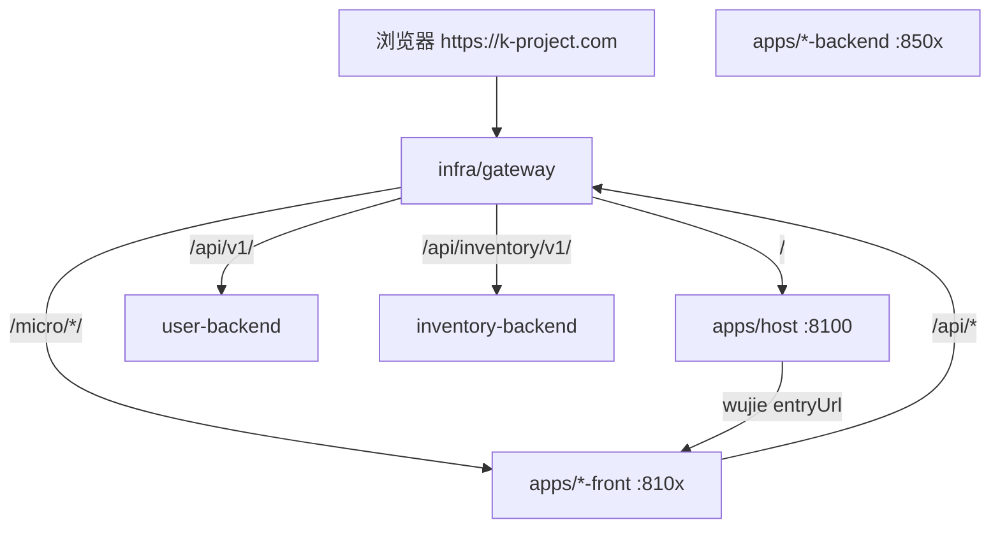

# 架构与调用链

## 拓扑

## 职责边界

| 层 | 目录 | 做什么 | 不做什么 |
|----|------|--------|----------|
| 入口 | infra/gateway | TLS、路径分流、upstream | 业务逻辑 |
| 壳 | apps/host | 布局、导航、页签、挂载子应用 | 子应用业务页 |
| 子应用 | apps/*-front | 域内 UI、调本域 API | 改 host 壳层（除非集成需求） |
| API | apps/*-backend | REST、JWT、GORM | 前端静态资源 |
| 导航 | user-backend | `/api/v1/navigation` | 库存业务数据 |

## API 前缀

| 服务 | 前缀 | 示例 |
|------|------|------|
| user-backend | `/api/v1/` | `/api/v1/navigation`, `/api/v1/auth/login` |
| inventory-backend | `/api/inventory/v1/` | `/api/inventory/v1/products` |

## 微前端 entry（同源）

| 子应用 | entry 路径 |
|--------|------------|
| hello-front | `/micro/hello/` |
| user-front | `/micro/user/` |
| inventory-front | `/micro/inventory/` |

Host 通过 navigation API 的 `entryUrl` + env（`MICRO_*_ENTRY_URL`）合并得到最终地址。

## 开发模式

| 模式 | 说明 |
|------|------|
| 同源（推荐） | Docker + gateway；`VITE_API_BASE` 留空 |
| 多端口 dev | 各 app `pnpm dev`；host `.env.development` 配 `VITE_*_FRONT_URL`；API 仍建议走 gateway 避免 CORS |

## 新增子应用

完整清单：[docs/SCAFFOLD_MICROFRONTEND.md](../../docs/SCAFFOLD_MICROFRONTEND.md)

最小触点：新 front 仓库 → gateway location → compose → host env → navigation seed → host SubAppView 路由事件（`{name}-route`）。
